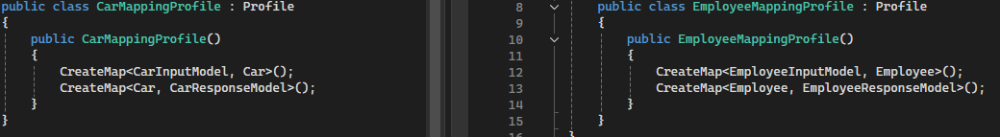

# Table of Contents
- [CRUDServiceLibrary](#crudservicelibrary)
- [ICRUDService](#icrudservicetservice)
- [IBaseEntity](#ibaseentity)
- [IBaseService](#ibaseservicetdatamodel)
- [CRUDController](#crudcontrollertservice)
- [How it Works](#how-it-works)
  
# CRUDServiceLibrary
The CRUDService is a generic, extensible service framework designed to simplify and centralize common CRUD (Create, Read, Update, Delete) operations in a REST Web API. It provides a flexible structure that can be adapted to manage different data models and services with minimal code duplication. By leveraging interfaces, inheritance, and type constraints, this service ensures that all CRUD operations follow a consistent approach while remaining highly reusable and maintainable across various domains.

The core idea behind CRUDService is to abstract the CRUD functionality into a generic class that can handle different types of models and services. This approach minimizes redundancy and maximizes code reuse by defining these operations only once and applying them across different services. Additionally, the service is integrated with AutoMapper to facilitate automatic mapping between input, data, and response models, ensuring a smooth and efficient transformation of data throughout the system.

# ICRUDService<TService, TDataModel, TInputModel, TResponseModel, TEntityId>
This interface defines the core CRUD operations for any service type. It provides methods for fetching all records, fetching a single record by ID, creating, updating, and deleting records.

Type Constraints:
 - TService: Must implement the IBaseService<TDataModel, TInputModel> interface, which defines the basic operations a service must perform.
 - TDataModel: Represents the entity being managed (e.g., a database table row) and must inherit from BaseEntity. This ensures that the model has essential fields like Id, CreatedAt, and UpdatedAt.
 - TInputModel: Represents the input data model, typically used for creating or updating an entity.
 - TResponseModel: Defines the structure for data returned to the client.
 - TEntityId: Represents the type of entity unique identifier (Id).

# IBaseEntity<TEndityId>
This interface defines common properties that all entities must have in database, ensuring a consistent structure across different data models. 

Type Constraints:
 - TEndityId:  Represents the type of entity unique identifier (Id).

# IBaseService<TDataModel, TInputModel, TEntityId>
The IBaseService interface defines the foundational CRUD (Create, Read, Update, Delete) operations for any service that interacts with data models. It is designed to provide a generic, reusable contract for managing data entities, ensuring a consistent structure across different services while allowing flexibility for service-specific implementations. This interface acts as the core of service-layer operations, and specific services (e.g., CarService, EmployeeService) can build upon this foundation to include additional, domain-specific logic.

Type Constraints:
 - TDataModel: The entity type representing the data stored in the database (e.g., Car, Employee). This type must inherit from IBaseEntity, ensuring that all data entities have common properties such as Id, CreatedAt, and UpdatedAt.
 - TInputModel: The model type used for accepting input during creation or update operations (e.g., CarInputModel, EmployeeInputModel). This enforces that services work with structured input data.
 - TEntityId: Represents the type of entity unique identifier (Id).

While IBaseService defines the core CRUD operations, specific services (such as IAnimalService or IUserService) inherit from this interface to provide service-specific behavior or extend the base CRUD operations with additional methods, if needed. This architecture promotes code reuse, reduces redundancy, and maintains a clean separation of concerns between models, services, and controllers.

# CRUDController<TService, TDataModel, TInputModel, TResponseModel, TEntityId>
The CRUDController is an abstract base class designed to streamline and standardize CRUD operations for various types of entities in a REST Web API. It serves as the foundation for specific controllers (e.g., CarController, EmployeeController) and provides a consistent way to handle Create, Read, Update, and Delete operations across different entity types. By leveraging generics and inheriting common functionality, this controller promotes reusability, reduces code duplication, and ensures consistency across different parts of the application.

Type Constraints:
 - TService: The specific service that handles the entity's CRUD operations, must implement IBaseService.
 - TDataModel: The data entity type (e.g., Car, Employee) representing the database table.
 - TInputModel: The input data structure (e.g., CarInputModel, EmployeeInputModel) used for create and update operations.
 - TResponseModel: The response structure (e.g., CarResponseModel, EmployeeResponseModel) sent back to the client.
 - TEntityId: Represents the type of entity unique identifier (Id)

This setup allows the CRUDController to be flexible enough to handle any entity without duplicating code for each controller.

# How it Works
## Step 1: Inherit IBaseEntity<TEndityId> inteface to your Entities for database
To ensure all your entities have consistent properties (such as Id, CreatedAt, and UpdatedAt), have your entities inherit from the IBaseEntity<TEntityId> interface. This establishes a standardized structure for all database entities, making them easier to manage and maintain.

### Image 1: Inherit the `IBaseEntity<TEndityId>` Interface

### Image 2: Example of an Entity Implementing the Interface

## Step 2: Create Input and Response models
### Image 1: Input models

### Image 2: Response models

## Step 3: Create interfaces for entity services and inherit IBaseService<TDataModel, TInputModel, TEntityId>
### Image 1: Interfaces for entity services

## Step 4: Implement entity services
### Image 1: Entity services

## Step 5: Create entity controllers and inherit CRUDController<TService, TDataModel, TInputModel, TResponseModel, TEntityId>
### Image 1: Entity controllers

## Step 6: Setup your mapping profiles for AutoMapper
### Image 1: Mapping profiles

## Step 7: Register your services in IoC
### Image 1: IoC

